# 🔌 Perfect ESP32 Hardware Circuit Diagram & Wiring Guide
**Project**: Smart Water Quality Monitoring System  
**Microcontroller**: ESP32 NodeMCU (38-Pin / 30-Pin)  
**Date**: August 26, 2026  


---

## 🎯 Pin-by-Pin Detailed Connection Guide

### 1️⃣ **1602A LCD Screen (16 Pins)**:
- **Pin 1 (VSS)** ➔ Connect to **GND Rail**
- **Pin 2 (VDD)** ➔ Connect to **5V Rail (VIN)**
- **Pin 3 (V0)** ➔ Connect to **GND Rail** *(Contrast)*
- **Pin 4 (RS)** ➔ Connect to **ESP32 GPIO 19**
- **Pin 5 (RW)** ➔ Connect to **GND Rail**
- **Pin 6 (E)** ➔ Connect to **ESP32 GPIO 23**
- **Pin 11 (D4)** ➔ Connect to **ESP32 GPIO 18**
- **Pin 12 (D5)** ➔ Connect to **ESP32 GPIO 17**
- **Pin 13 (D6)** ➔ Connect to **ESP32 GPIO 16**
- **Pin 14 (D7)** ➔ Connect to **ESP32 GPIO 15**
- **Pin 15 (BLA)** ➔ Connect to **5V Rail (VIN)** *(Backlight +)*
- **Pin 16 (BLK)** ➔ Connect to **GND Rail** *(Backlight -)*

---

### 2️⃣ **pH Sensor Signal Board (6 Pins)**:
- **`V+` / `VCC`** ➔ Connect to **5V Rail (VIN)**
- **`GND`** ➔ Connect to **GND Rail**
- **`Po`** ➔ Connect to **ESP32 GPIO 32**

---

### 3️⃣ **DS18B20 Temperature Sensor Probe (3 Wires)**:
- **Red Wire (VCC)** ➔ Connect to **3.3V Rail (3V3)**
- **Black Wire (GND)** ➔ Connect to **GND Rail**
- **Yellow Wire (Data)** ➔ Connect to **ESP32 GPIO 4**

---

### 4️⃣ **TDS Meter V1.0 (3 Pins)**:
- **`+` (VCC)** ➔ Connect to **5V Rail (VIN)**
- **`-` (GND)** ➔ Connect to **GND Rail**
- **`A` (Analog Out)** ➔ Connect to **ESP32 GPIO 34**

---

### 5️⃣ **Turbidity Sensor Module (3 Pins)**:
- **`V` (VCC)** ➔ Connect to **5V Rail (VIN)**
- **`G` (GND)** ➔ Connect to **GND Rail**
- **`A` (Analog Out)** ➔ Connect to **ESP32 GPIO 35**

---

### 6️⃣ **12V 2A Power Adapter**:
- **12V Positive (`+`) Wire** ➔ Connect to **ESP32 VIN Pin & 5V Rail**
- **12V Negative (`-`) Wire** ➔ Connect to **Common GND Rail**

```mermaid
flowchart TD
    subgraph POWER["⚡ Power Supply Subsystem"]
        ADP["12V 2A Power Adapter"] -->|12V / GND| ESP_VIN["ESP32 VIN Pin & GND"]
        BAT["18650 Battery Pack"] -.->|3.7V / GND| ESP_VIN
    end

    subgraph ESP["🧠 ESP32 Microcontroller Core"]
        ESP_VIN
        GND["Common Ground Rail (GND)"]
        V5["Power Rail (5V / VIN)"]
        V3["Power Rail (3.3V)"]
        
        P4["GPIO 4 (OneWire)"]
        P15["GPIO 15 (LCD D7)"]
        P16["GPIO 16 (LCD D6)"]
        P17["GPIO 17 (LCD D5)"]
        P18["GPIO 18 (LCD D4)"]
        P19["GPIO 19 (LCD RS)"]
        P23["GPIO 23 (LCD Enable)"]
        P32["GPIO 32 (ADC1_CH4)"]
        P34["GPIO 34 (ADC1_CH6)"]
        P35["GPIO 35 (ADC1_CH7)"]
    end

    subgraph LCD["🖥️ 1602A 16x2 LCD Display (Parallel 4-Bit)"]
        LCD_GND["Pin 1 (GND)"] --> GND
        LCD_VDD["Pin 2 (VDD)"] --> V5
        LCD_VO["Pin 3 (VO)"] --> GND
        LCD_RS["Pin 4 (RS)"] --> P19
        LCD_RW["Pin 5 (RW)"] --> GND
        LCD_E["Pin 6 (E)"] --> P23
        LCD_D4["Pin 11 (D4)"] --> P18
        LCD_D5["Pin 12 (D5)"] --> P17
        LCD_D6["Pin 13 (D6)"] --> P16
        LCD_D7["Pin 14 (D7)"] --> P15
        LCD_BLA["Pin 15 (BLA)"] --> V5
        LCD_BLK["Pin 16 (BLK)"] --> GND
    end

    subgraph SENSORS["🧪 Water Quality Sensor Array"]
        subgraph PH["pH Sensor Module"]
            PH_VCC["V+ / VCC"] --> V5
            PH_GND["GND"] --> GND
            PH_PO["Po (Analog Out)"] --> P32
            PH_BNC["BNC Socket"] --- PH_PROBE["Glass Electrode Probe"]
        end

        subgraph TEMP["DS18B20 Temp Probe"]
            TEMP_RED["Red Wire (VCC)"] --> V3
            TEMP_BLK["Black Wire (GND)"] --> GND
            TEMP_YEL["Yellow Wire (Data)"] --> P4
        end

        subgraph TDS["TDS Meter V1.0"]
            TDS_VCC["+ (VCC)"] --> V5
            TDS_GND["- (GND)"] --> GND
            TDS_OUT["A (Analog Out)"] --> P34
            TDS_CON["2-Pin Socket"] --- TDS_PROBE["Waterproof TDS Probe"]
        end

        subgraph TURB["Turbidity Sensor Module"]
            TURB_VCC["V (VCC)"] --> V5
            TURB_GND["G (GND)"] --> GND
            TURB_OUT["A (Analog Out)"] --> P35
            TURB_CON["3-Pin Socket"] --- TURB_OPT["Blue Optical Housing"]
        end
    end
```



---

## 📌 Complete Pin Mapping Master Table

| # | Component Name | Component Pin Label | Connected to ESP32 Pin | Wire Color Code | Wire Connector Type | Notes / Purpose |
|---|---|---|---|---|---|---|
| **1** | **1602A LCD** | Pin 1 (GND) | **GND** | 🖤 Black | Female-to-Male | Power Ground |
| **2** | **1602A LCD** | Pin 2 (VDD) | **VIN (5V)** | 🔴 Red | Female-to-Male | Power 5V |
| **3** | **1602A LCD** | Pin 3 (VO) | **GND** | 🖤 Black | Female-to-Male | Contrast Control |
| **4** | **1602A LCD** | Pin 4 (RS) | **GPIO 19** | 💜 Purple | Female-to-Male | Register Select |
| **5** | **1602A LCD** | Pin 5 (RW) | **GND** | 🖤 Black | Female-to-Male | Read/Write (Write=GND) |
| **6** | **1602A LCD** | Pin 6 (E) | **GPIO 23** | ⚪ White | Female-to-Male | Enable Clock Signal |
| **7** | **1602A LCD** | Pin 11 (D4) | **GPIO 18** | 💙 Blue | Female-to-Male | Data Bit 4 |
| **8** | **1602A LCD** | Pin 12 (D5) | **GPIO 17** | 💚 Green | Female-to-Male | Data Bit 5 |
| **9** | **1602A LCD** | Pin 13 (D6) | **GPIO 16** | 💛 Yellow | Female-to-Male | Data Bit 6 |
| **10**| **1602A LCD** | Pin 14 (D7) | **GPIO 15** | 🟠 Orange | Female-to-Male | Data Bit 7 |
| **11**| **1602A LCD** | Pin 15 (BLA) | **VIN (5V)** | 🔴 Red | Female-to-Male | Backlight Anode (+) |
| **12**| **1602A LCD** | Pin 16 (BLK) | **GND** | 🖤 Black | Female-to-Male | Backlight Cathode (-) |
| **13**| **pH Sensor Board**| `V+` / `VCC` | **VIN (5V)** | 🔴 Red | Female-to-Female | Module Power |
| **14**| **pH Sensor Board**| `GND` | **GND** | 🖤 Black | Female-to-Female | Power Ground |
| **15**| **pH Sensor Board**| `Po` | **GPIO 32** | 💙 Blue | Female-to-Female | Analog pH Voltage Signal |
| **16**| **DS18B20 Temp Probe**| Red Wire | **3V3** (or VIN) | 🔴 Red | Striped Wire Lead | Temperature Power |
| **17**| **DS18B20 Temp Probe**| Black Wire | **GND** | 🖤 Black | Striped Wire Lead | Temperature Ground |
| **18**| **DS18B20 Temp Probe**| Yellow Wire | **GPIO 4** | 💛 Yellow | Striped Wire Lead | OneWire Digital Data |
| **19**| **TDS Meter V1.0** | `+` (VCC) | **VIN (5V)** | 🔴 Red | Female-to-Female | TDS Module Power |
| **20**| **TDS Meter V1.0** | `-` (GND) | **GND** | 🖤 Black | Female-to-Female | Power Ground |
| **21**| **TDS Meter V1.0** | `A` (Out) | **GPIO 34** | 💚 Green | Female-to-Female | Analog TDS Voltage Signal |
| **22**| **Turbidity Sensor**| `V` (VCC) | **VIN (5V)** | 🔴 Red | Female-to-Female | Turbidity Power |
| **23**| **Turbidity Sensor**| `G` (GND) | **GND** | 🖤 Black | Female-to-Female | Power Ground |
| **24**| **Turbidity Sensor**| `A` (Out) | **GPIO 35** | 🟠 Orange | Female-to-Female | Analog Turbidity Signal |
| **25**| **Power Adapter** | 12V Positive (`+`) | **VIN** | 🔴 Thick Red Wire | DC Barrel Jack Adapter | System Power Input |
| **26**| **Power Adapter** | 12V Negative (`-`) | **GND** | 🖤 Thick Black Wire | DC Barrel Jack Adapter | System Power Ground |

---

## ⚡ Power Distribution & Electrical Rails

```text
       +-------------------------------------------------------+
       |             COMMON POWER RAILS (BREADBOARD)           |
       +-------------------------------------------------------+
                                  |
            [12V 2A Adapter] ---->| (Plugged to Wall Socket)
                                  v
                   [ESP32 VIN Pin] ---> 5V Power Rail  ===> Powers: LCD VDD, LCD BLA, pH VCC, TDS VCC, Turbidity VCC
                   [ESP32 3V3 Pin] ---> 3.3V Power Rail ==> Powers: DS18B20 Red Wire
                   [ESP32 GND Pin] ---> Common GND Rail ==> Connects: ALL GND & Negative Wires together
```

> [!IMPORTANT]
> **Common Ground Rule**: All sensor `-` / `GND` pins, LCD `GND` pins, and Power Adapter `-` wires MUST be connected together on the shared Ground rail!

---

## 🛠️ Calibration & Adjustment Instructions

1. **LCD Contrast Adjustment**:
   - If the LCD screen lights up blue but text is faint or invisible, connect Pin 3 (`VO`) to a 10k potentiometer middle leg (or directly to GND for maximum contrast).
2. **pH Sensor Probe Preparation**:
   - Remove the plastic storage cap filled with KCl solution from the glass pH electrode before dipping into water.
3. **TDS Probe Usage**:
   - Submerge the white waterproof prongs into water. Do not submerge the black wiring connector above the water line.
4. **Turbidity Sensor Positioning**:
   - Keep the blue optical sensor housing upright so water flows freely between the light transmitter and receiver.

---

## 📁 File Location
This official document is stored in the workspace directory:
`c:\Users\vasundhra\OneDrive\water quality monotoring system\circuit_diagram\README.md`
